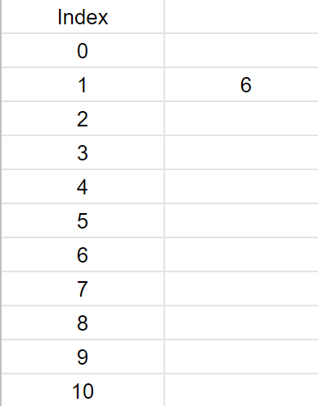
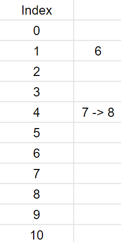

#How Hash works, why search time O(1) 
Assum we have a Hash function:
`(x * x) % 5` This is way to simple for real, so it just an example.
If we put `6` into a Hash table using our Hash function, the Hash value for `6` will be `1`. So the result looks like this:  
  

The search time complicity is O(1) because if we want to find `6`, we just need to calculate the Hash value of `6` and the value will be the index.  

There are problems. If we put `7` and `8` into the table (both of them have the same Hash value `4`), the Hash collision happens. In Java `HashMap` it can be handled as link `8` after `7`. Looks like this:  
  